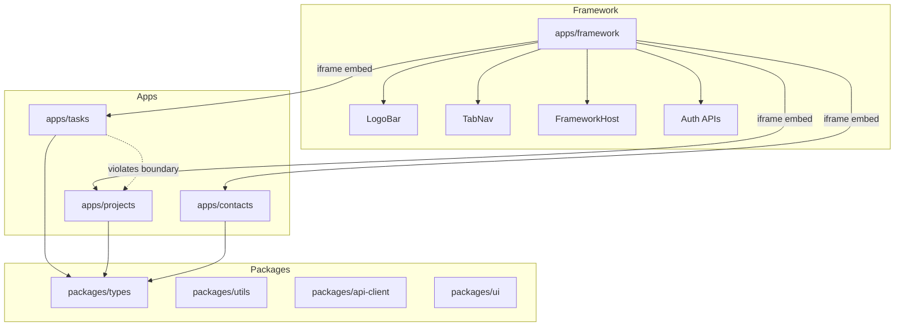

# FOMO Life Architecture Analysis

**Date**: 2026-03-01  
**Status**: Analysis Complete

---

## Executive Summary

The FOMO Life monorepo has successfully completed a major migration from a single-app architecture to a multi-app monorepo. The architecture is fundamentally sound, but several areas need attention to improve maintainability, reduce technical debt, and prepare for future growth.

---

## Current Architecture Overview



---

## Strengths

### 1. Clean Monorepo Setup
- **pnpm workspaces** with proper workspace protocol (`workspace:*`)
- **Turbo pipelines** configured for dev, build, lint, test, typecheck
- **Clear app separation** with independent Vercel deployments

### 2. Framework Host Pattern
- Centralized authentication via [`FrameworkHost.tsx`](apps/framework/components/FrameworkHost.tsx)
- Tab navigation with URL state management
- iframe-based micro-frontend approach allows independent deployments

### 3. Environment Configuration
- Per-app auth modes (`FRAMEWORK_AUTH_MODE`, `TASKS_AUTH_MODE`, etc.)
- Environment variable isolation between apps
- Production URL configuration via `NEXT_PUBLIC_*_APP_URL`

### 4. Git Safety Guardrails
- Pre-commit/pre-push hooks for large file detection
- CI validation gates documented in README

---

## Issues Identified

### Critical: Boundary Violation

**Location**: [`apps/tasks/components/TasksPage.tsx`](apps/tasks/components/TasksPage.tsx:7-9)

```typescript
// Lines 7-9 - VIOLATES BOUNDARY RULE
import TaskList from '../../projects/components/TaskList';
import AddBar from '../../projects/components/AddBar';
import { applyFilters } from '../../projects/utils/taskFilters';
```

**Impact**: 
- Violates the stated rule: "Apps do not import from other apps"
- Creates hidden coupling between tasks and projects
- Breaks independent deployment capability
- Type safety compromised with `as any` casts

### High Priority: Mixed Language/Type Safety

**Projects app uses JavaScript** while other apps use TypeScript:
- [`TaskList.js`](apps/projects/components/TaskList.js)
- [`AddBar.js`](apps/projects/components/AddBar.js)
- [`TaskModal.js`](apps/projects/components/TaskModal.js)
- Many more `.js` files in projects

**Impact**:
- Inconsistent developer experience
- Reduced type safety in projects app
- Harder to refactor shared patterns

### Medium Priority: Shared Package Underutilization

| Package | Status | Contents |
|---------|--------|----------|
| `packages/types` | Skeleton | Only index.ts with minimal exports |
| `packages/utils` | Minimal | Only invite.ts utility |
| `packages/api-client` | Minimal | Only contacts.ts |
| `packages/ui` | Skeleton | Only ui-button component |

**Impact**:
- Code duplication across apps
- No shared domain types for Task, Project, Contact
- Inconsistent UI patterns

### Medium Priority: CSS Architecture

- Mix of CSS modules (`.module.css`) and inline styles
- Large legacy CSS files in projects app:
  - [`projects.css`](apps/projects/styles/projects.css) - 39,094 chars
  - [`tabs.css`](apps/projects/styles/tabs.css) - 32,623 chars
- Inline styles in [`TasksPage.tsx`](apps/tasks/components/TasksPage.tsx:218-386) reduce maintainability

### Low Priority: No E2E Testing

From README:
> No dedicated Playwright/Cypress E2E suite is currently checked into this repository.

---

## Recommendations

### Phase 1: Fix Critical Issues

#### 1.1 Extract Shared Components to Packages

Move shared components from projects to packages:

```
packages/
├── ui/
│   ├── src/
│   │   ├── TaskList/
│   │   │   ├── TaskList.tsx
│   │   │   ├── TaskList.module.css
│   │   │   └── index.ts
│   │   ├── AddBar/
│   │   │   ├── AddBar.tsx
│   │   │   └── index.ts
│   │   └── index.ts
│   └── package.json
├── types/
│   ├── src/
│   │   ├── task.ts
│   │   ├── project.ts
│   │   ├── contact.ts
│   │   └── index.ts
│   └── package.json
└── utils/
    ├── src/
    │   ├── taskFilters.ts
    │   ├── invite.ts
    │   └── index.ts
    └── package.json
```

#### 1.2 Update Import Paths

After extraction, update tasks app:

```typescript
// Before (boundary violation)
import TaskList from '../../projects/components/TaskList';

// After (proper shared package)
import { TaskList } from '@myorg/ui';
import type { TaskItem } from '@myorg/types';
```

### Phase 2: Improve Type Safety

#### 2.1 Convert Projects App to TypeScript

Priority order for conversion:
1. Shared components first (TaskList, AddBar, TaskModal)
2. Utility functions (taskFilters, generateId)
3. Page components (ProjectsPage, ProjectsDashboard)

#### 2.2 Define Shared Domain Types

```typescript
// packages/types/src/task.ts
export interface TaskItem {
  id: string;
  text: string;
  description?: string;
  dueDate?: string;
  done: boolean;
  favorite: boolean;
  createdAt: string;
  updatedAt: string;
  userId: string;
}

// packages/types/src/project.ts
export interface Project {
  id: string;
  name: string;
  description?: string;
  subprojects: Subproject[];
  // ...
}
```

### Phase 3: CSS Consolidation

#### 3.1 Migrate to CSS Modules

Replace inline styles with CSS modules:
- [`TasksPage.tsx`](apps/tasks/components/TasksPage.tsx) inline styles → `TasksPage.module.css`
- Dashboard cards → dedicated component with CSS module

#### 3.2 Split Legacy CSS

Break down large CSS files:
- `projects.css` (39KB) → component-specific modules
- `tabs.css` (32KB) → navigation-specific modules

### Phase 4: Testing Infrastructure

#### 4.1 Add E2E Testing

```bash
pnpm add -Dw @playwright/test
```

Priority test scenarios:
1. Authentication flow
2. Tab navigation between apps
3. CRUD operations for tasks, projects, contacts
4. Mobile responsiveness

### Phase 5: Future Enhancements

From [`IDEAS.md`](IDEAS.md):

1. **Mobile-first list redesign** - Move add input to bottom
2. **Bottom-sheet editor** - Replace right-panel editor
3. **AI-assisted project breakdown** - POC for subtask generation
4. **API integrations** - Webhooks, export/import, third-party sync

---

## Architecture Decision Records

### ADR-001: iframe-based Micro-Frontend

**Status**: Accepted

The framework app uses iframes to embed task/project/contact apps. This enables:
- Independent deployments
- Technology flexibility
- Isolated runtime environments

**Trade-offs**:
- Communication limited to URL parameters
- No shared JavaScript context
- Slight performance overhead

### ADR-002: Per-App Authentication Mode

**Status**: Accepted

Each app has `AUTH_MODE` and `DEFAULT_USER_ID` environment variables. This enables:
- Development without auth
- Production with real auth
- Per-app testing scenarios

---

## Metrics to Track

| Metric | Current | Target |
|--------|---------|--------|
| Boundary violations | 3 imports | 0 |
| TypeScript coverage | ~60% | 100% |
| Shared package exports | 5 | 20+ |
| E2E test coverage | 0% | 80% |
| CSS file size (largest) | 39KB | <10KB |

---

## Next Steps

1. **Immediate**: Create extraction plan for shared components
2. **Short-term**: Convert projects app to TypeScript
3. **Medium-term**: Implement E2E testing
4. **Long-term**: Execute IDEAS.md roadmap

---

## Appendix: File Reference

### Key Files Analyzed

| File | Purpose | Issues |
|------|---------|--------|
| [`FrameworkHost.tsx`](apps/framework/components/FrameworkHost.tsx) | Main shell component | None |
| [`TasksPage.tsx`](apps/tasks/components/TasksPage.tsx) | Tasks UI | Boundary violation, inline styles |
| [`TaskList.js`](apps/projects/components/TaskList.js) | Shared list component | JavaScript, should be in package |
| [`frameworkConfig.ts`](apps/framework/lib/frameworkConfig.ts) | Tab configuration | None |
| [`turbo.json`](turbo.json) | Build pipeline | None |
| [`STATE.json`](migration-plan/STATE.json) | Migration status | Complete |
