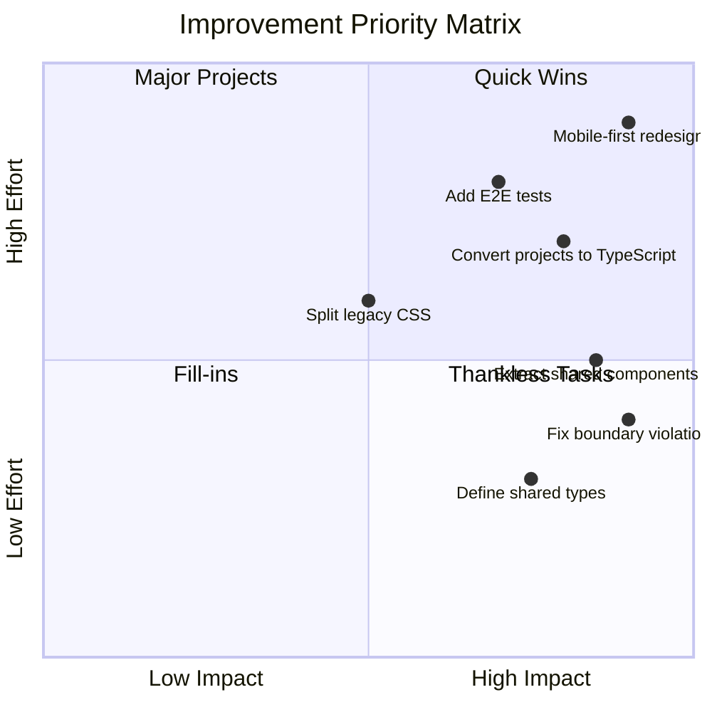

# FOMO Life Improvement Roadmap

**Created**: 2026-03-01  
**Based on**: [Architecture Analysis](architecture-analysis.md)

---

## Priority Matrix



---

## Phase 1: Critical Fixes

### 1.1 Extract Shared Components to Packages

**Problem**: Tasks app imports from Projects app, violating boundary rule.

**Solution**: Move shared components to `packages/ui`.

#### Step-by-Step Plan

- [ ] **Create shared type definitions**
  - Create `packages/types/src/task.ts` with `TaskItem` interface
  - Create `packages/types/src/person.ts` with `Person` interface
  - Export from `packages/types/src/index.ts`
  - Update `packages/types/package.json` exports

- [ ] **Extract TaskList component**
  - Create `packages/ui/src/TaskList/TaskList.tsx`
  - Convert from JS to TypeScript with proper types
  - Create `packages/ui/src/TaskList/TaskList.module.css`
  - Export from `packages/ui/src/TaskList/index.ts`
  - Update `packages/ui/package.json` exports

- [ ] **Extract AddBar component**
  - Create `packages/ui/src/AddBar/AddBar.tsx`
  - Create styles if needed
  - Export from `packages/ui/src/AddBar/index.ts`

- [ ] **Extract taskFilters utility**
  - Create `packages/utils/src/taskFilters.ts`
  - Add proper TypeScript types
  - Export from `packages/utils/src/index.ts`

- [ ] **Update apps to use shared packages**
  - Update `apps/tasks/components/TasksPage.tsx` imports
  - Update `apps/projects/components/` imports
  - Remove `as any` type casts
  - Run typecheck to verify

#### Files to Create/Modify

| Action | File |
|--------|------|
| Create | `packages/types/src/task.ts` |
| Create | `packages/types/src/person.ts` |
| Modify | `packages/types/src/index.ts` |
| Create | `packages/ui/src/TaskList/TaskList.tsx` |
| Create | `packages/ui/src/TaskList/index.ts` |
| Create | `packages/ui/src/AddBar/AddBar.tsx` |
| Create | `packages/ui/src/AddBar/index.ts` |
| Create | `packages/utils/src/taskFilters.ts` |
| Modify | `apps/tasks/components/TasksPage.tsx` |
| Modify | `apps/projects/components/` (multiple files) |

---

### 1.2 Define Shared Domain Types

**Problem**: No shared type definitions lead to `as any` casts and type mismatches.

**Solution**: Create comprehensive type definitions in `packages/types`.

#### Type Definitions to Create

```typescript
// packages/types/src/task.ts
export interface TaskItem {
  id: string;
  text: string;
  description: string;
  dueDate: string | null;
  done: boolean;
  favorite: boolean;
  starred?: boolean; // legacy alias
  createdAt: string;
  updatedAt: string;
  userId: string;
}

export type TaskFilter = 'completed' | 'overdue' | 'upcoming' | 'starred';

export interface TaskCreateInput {
  text: string;
  description?: string;
  dueDate?: string;
  favorite?: boolean;
}

export interface TaskUpdateInput {
  text?: string;
  description?: string;
  dueDate?: string | null;
  favorite?: boolean;
  done?: boolean;
}
```

---

## Phase 2: Type Safety Improvements

### 2.1 Convert Projects App to TypeScript

**Problem**: Projects app uses JavaScript, reducing type safety.

**Solution**: Systematic conversion to TypeScript.

#### Conversion Order

1. **Utility files** (lowest risk)
   - [ ] `apps/projects/utils/generateId.js` → `generateId.ts`
   - [ ] `apps/projects/utils/taskFilters.js` → (move to packages)

2. **Simple components**
   - [ ] `AddBar.js` → (extract to packages)
   - [ ] `Task.js` → `Task.tsx`

3. **Complex components**
   - [ ] `TaskList.js` → (extract to packages)
   - [ ] `TaskRow.js` → `TaskRow.tsx`
   - [ ] `TaskModal.js` → `TaskModal.tsx`

4. **Page components**
   - [ ] `ProjectsPage.tsx` (already TS, review types)
   - [ ] `ProjectsDashboard.js` → `ProjectsDashboard.tsx`
   - [ ] `ProjectEditor.js` → `ProjectEditor.tsx`
   - [ ] `ProjectTile.js` → `ProjectTile.tsx`

#### tsconfig Updates

```json
// apps/projects/tsconfig.json - add strict mode
{
  "compilerOptions": {
    "strict": true,
    "noImplicitAny": true,
    "noUncheckedIndexedAccess": true
  }
}
```

---

## Phase 3: CSS Architecture

### 3.1 Replace Inline Styles

**Problem**: Inline styles in TasksPage reduce maintainability.

**Solution**: Move to CSS modules.

#### Files to Update

- [ ] Extract inline styles from `TasksPage.tsx` lines 218-386
- [ ] Create/update `TasksPage.module.css`
- [ ] Apply consistent class naming

### 3.2 Split Legacy CSS Files

**Problem**: Large monolithic CSS files are hard to maintain.

**Solution**: Split into component-specific modules.

#### CSS Split Plan

```
apps/projects/styles/
├── projects.css (39KB) → split into:
│   ├── components/
│   │   ├── ProjectTile.module.css
│   │   ├── ProjectEditor.module.css
│   │   └── SubprojectRow.module.css
│   └── layout.module.css
│
└── tabs.css (32KB) → split into:
    ├── components/
    │   ├── TabNav.module.css
    │   └── TabContent.module.css
    └── shared/
        └── animations.module.css
```

---

## Phase 4: Testing Infrastructure

### 4.1 Add Playwright E2E Tests

**Problem**: No automated E2E testing.

**Solution**: Implement Playwright test suite.

#### Setup Steps

- [ ] Install Playwright: `pnpm add -Dw @playwright/test`
- [ ] Create `playwright.config.ts`
- [ ] Create test directory structure:
  ```
  tests/
  ├── auth.spec.ts
  ├── navigation.spec.ts
  ├── tasks.spec.ts
  ├── projects.spec.ts
  └── contacts.spec.ts
  ```

#### Priority Test Cases

1. **Authentication Flow**
   - Login with Google
   - Session persistence
   - Logout

2. **Navigation**
   - Tab switching
   - URL state preservation
   - Deep links

3. **CRUD Operations**
   - Create task/project/contact
   - Update task/project/contact
   - Delete task/project/contact

4. **Mobile Responsiveness**
   - Viewport scaling
   - Touch interactions

---

## Phase 5: Future Features

### From IDEAS.md

#### 5.1 Mobile-First List Redesign

**Current State**: Desktop-focused layout  
**Target State**: Mobile-first with bottom add input

**Implementation Steps**:
- [ ] Create responsive breakpoint system
- [ ] Move AddBar to fixed bottom position on mobile
- [ ] Convert to single-column layout for small screens
- [ ] Test on various device sizes

#### 5.2 Bottom-Sheet Editor

**Current State**: Right-panel editor  
**Target State**: Responsive bottom-sheet

**Implementation Steps**:
- [ ] Create BottomSheet component in `packages/ui`
- [ ] Implement drag handle for height adjustment
- [ ] Add desktop modal alternative
- [ ] Replace TaskModal usage

#### 5.3 AI-Assisted Project Breakdown

**Current State**: Not implemented  
**Target State**: POC for AI subtask generation

**Implementation Steps**:
- [ ] Create API endpoint for AI generation
- [ ] Add UI button in ProjectEditor
- [ ] Implement review/edit flow for generated subtasks
- [ ] Add privacy controls

---

## Execution Timeline

| Phase | Priority | Dependencies |
|-------|----------|--------------|
| Phase 1.1 | Critical | None |
| Phase 1.2 | Critical | Phase 1.1 |
| Phase 2.1 | High | Phase 1.2 |
| Phase 3.1 | Medium | None |
| Phase 3.2 | Medium | Phase 3.1 |
| Phase 4.1 | Medium | Phase 1.1 |
| Phase 5.x | Low | Phases 1-4 |

---

## Success Criteria

### Phase 1 Complete When:
- [ ] No boundary violations detected by linter
- [ ] `pnpm typecheck:mono` passes with no `as any` in tasks app
- [ ] All apps build successfully with shared package imports

### Phase 2 Complete When:
- [ ] All projects app files are `.ts` or `.tsx`
- [ ] Strict mode enabled with no errors
- [ ] Full type coverage for shared components

### Phase 3 Complete When:
- [ ] No inline styles in component files
- [ ] All CSS files under 10KB
- [ ] CSS modules used consistently

### Phase 4 Complete When:
- [ ] E2E tests cover all critical paths
- [ ] Tests run in CI pipeline
- [ ] 80%+ coverage of user flows

---

## Risk Mitigation

| Risk | Mitigation |
|------|------------|
| Breaking changes during extraction | Incremental migration with feature flags |
| Type errors blocking development | Use `// TODO: type` comments for gradual fix |
| CSS regression | Visual regression testing with Playwright |
| Test flakiness | Use stable selectors, retry logic |

---

## Next Action

**Recommended starting point**: Phase 1.1 - Extract Shared Components

This addresses the critical boundary violation and enables all subsequent improvements. Switch to Code mode to begin implementation.
